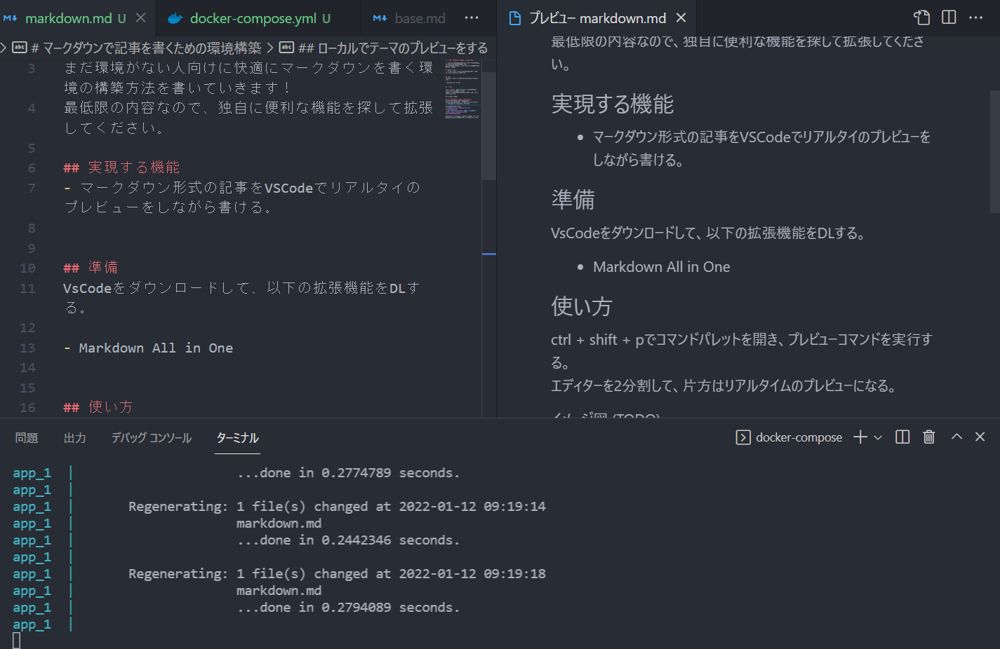

## マークダウンで記事を書くための環境構築

まだ環境がない人向けに快適にマークダウンを書く環境の構築方法を書いていきます！
最低限の内容なので、独自に便利な機能を探して拡張してください。

### 実現する機能
- マークダウン形式の記事をVSCodeでリアルタイのプレビューをしながら書ける

### 準備
VsCodeをダウンロードして、以下の拡張機能をDLする。

- Markdown All in One (キーボードショートカットや補完などを追加してくれる)

### 使い方

ctrl + k -> vのショートカットを打つと、エディターが2分割になって、片方はリアルタイムのプレビューになる。

### ローカルでテーマのプレビューをする
ここから先は余裕がある方向けです。
github pagesに表示される内容のプレビューをするために、docker-composeを使います。

dockerインストール方法
- [windows](https://makise-lab.com/dockerdesktop_1/)
- [mac (インストール部分だけで問題ないです)](https://qiita.com/gahoh/items/92217e0a887bb81e3155)

インストール後はルートで`docker-compose up`のコマンドを実行するだけです。localhost:4000から見れるようになります。